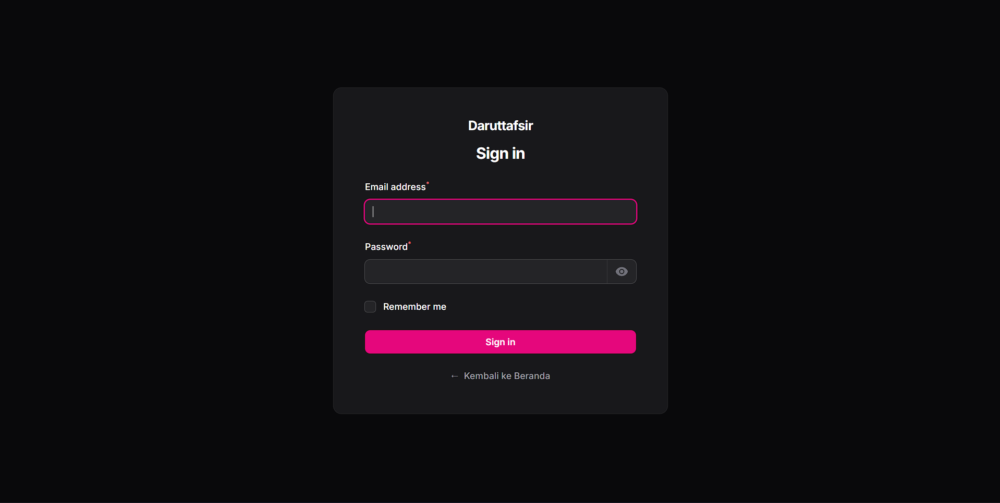
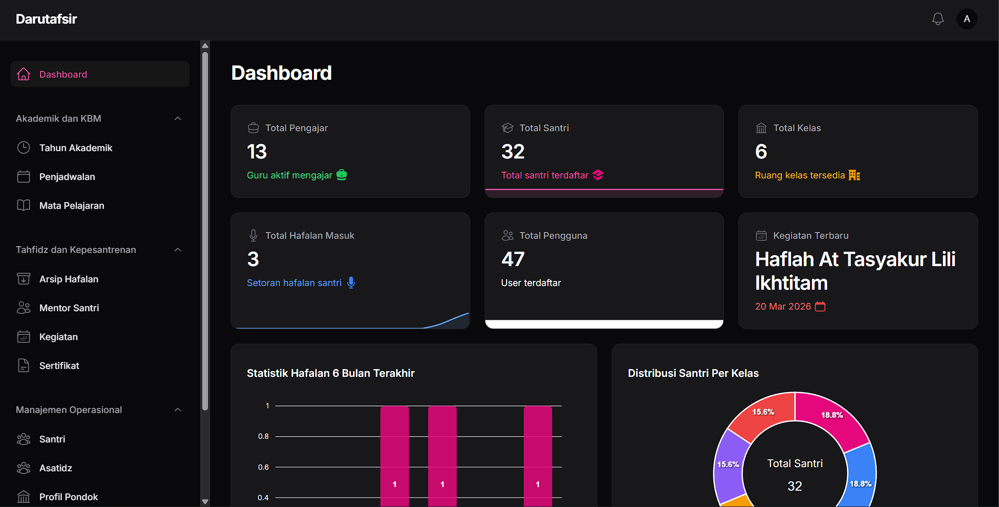
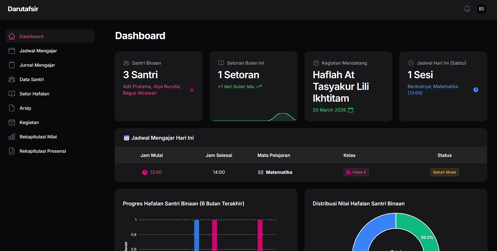

<p align="center">
  
</p>

<h1 align="center">SIDATA — Sistem Informasi Darut Tafsir</h1>

<p align="center">
  Sistem informasi manajemen pesantren tahfidz berbasis web untuk mengelola kegiatan akademik, hafalan Al-Qur'an, dan administrasi pesantren secara digital.
</p>

<p align="center">
  
  
  
  
  
</p>

---

## 📖 Tentang Project

**SIDATA (Sistem Informasi Darut Tafsir)** adalah aplikasi web yang dirancang khusus untuk membantu pengelolaan pesantren tahfidz **Daruttafsir**. Aplikasi ini menyediakan platform terpadu yang menghubungkan seluruh elemen pesantren — mulai dari admin, guru/ustadz, orang tua santri, hingga petugas keamanan — dalam satu ekosistem digital yang terintegrasi.

Sistem ini mencakup pengelolaan data santri, pencatatan setoran hafalan Al-Qur'an beserta penilaian tajwid (Makharijul Huruf, Shifatul Huruf, Ahkamul Qiroat, Ahkamul Waqfi, Qowaid Tafsir, dan Tarjamatul Ayat), manajemen jadwal pelajaran, jurnal pengajaran, absensi, perizinan santri, hingga penerbitan sertifikat.

---

## ❓ Latar Belakang & Alasan Pembuatan

Pengelolaan pesantren tahfidz secara konvensional menghadapi berbagai tantangan, antara lain:

| Permasalahan | Dampak |
|---|---|
| 📝 Pencatatan hafalan manual | Data setoran dan perkembangan hafalan santri rentan hilang, tidak terorganisir, dan sulit direkap |
| 📊 Penilaian tidak terstandar | Penilaian tajwid (makharijul huruf, shifatul huruf, dll.) tidak terdokumentasi dengan baik sehingga sulit mengukur progres santri |
| 📋 Administrasi tersebar | Data santri, guru, kelas, jadwal, dan kegiatan dikelola secara terpisah tanpa integrasi |
| 👨‍👩‍👧 Keterbatasan informasi orang tua | Orang tua kesulitan memantau perkembangan hafalan, nilai, dan kehadiran anaknya secara real-time |
| 🔒 Perizinan tidak terdokumentasi | Proses izin keluar/masuk santri tidak tercatat dengan baik oleh petugas keamanan |

**SIDATA** hadir sebagai solusi untuk mendigitalisasi seluruh proses tersebut, sehingga:

- ✅ **Efisiensi Operasional** — Seluruh pencatatan dan administrasi dilakukan secara digital, mengurangi beban kerja manual.
- ✅ **Akurasi Data** — Data tersimpan secara terpusat di database, mengurangi risiko human error dan kehilangan data.
- ✅ **Transparansi Informasi** — Orang tua dapat memantau perkembangan anaknya secara langsung melalui panel khusus.
- ✅ **Penilaian Terstandar** — Sistem penilaian hafalan dengan 6 komponen tajwid yang terukur dan konsisten.
- ✅ **Keamanan Tercatat** — Perizinan keluar/masuk santri terdokumentasi oleh pos keamanan.

---

## 👥 Peran Pengguna (Multi-Role)

Sistem ini mendukung **4 peran pengguna** dengan panel dashboard masing-masing:

### 🔑 Admin
Panel utama untuk mengelola seluruh data pesantren, termasuk:
- Manajemen pengguna dan role
- Data santri, guru, dan kelas
- Tahun akademik dan mata pelajaran
- Setoran hafalan dan target hafalan
- Penjadwalan dan fasilitas
- Profil pesantren (landing page)
- Arsip dokumen dan sertifikat
- Pembimbing santri (mentor)

### 👨‍🏫 Guru / Ustadz
Panel khusus guru untuk keperluan akademik dan tahfidz:
- Input setoran hafalan santri & penilaian tajwid
- Rekap nilai dan presensi santri
- Manajemen data kelas yang diampu
- Jurnal pengajaran
- Jadwal pelajaran
- Kegiatan pesantren
- Arsip dokumen

### 👨‍👩‍👧 Orang Tua
Panel monitoring untuk orang tua/wali santri:
- Melihat progres hafalan anak
- Riwayat setoran dan nilai
- Informasi perizinan anak
- Kegiatan pesantren
- Sertifikat anak
- Arsip informasi

### 🛡️ Keamanan
Panel petugas keamanan/pos jaga:
- Pencatatan perizinan keluar/masuk santri
- Arsip dokumen keamanan

---

## 🛠️ Tech Stack

| Kategori | Teknologi | Versi |
|---|---|---|
| **Backend Framework** | [Laravel](https://laravel.com) | 12.x |
| **Admin Panel** | [Filament PHP](https://filamentphp.com) | 3.x |
| **Bahasa Pemrograman** | PHP | 8.2+ |
| **CSS Framework** | [TailwindCSS](https://tailwindcss.com) | 4.x |
| **Build Tool** | [Vite](https://vitejs.dev) | 6.x |
| **Database** | SQLite / MySQL | - |
| **Chart Library** | [Filament Apex Charts](https://github.com/leandrocfe/filament-apex-charts) | 3.x |
| **PDF Generator** | [Laravel DomPDF](https://github.com/barryvdh/laravel-dompdf) | 3.x |
| **Local Dev Server** | [Laravel Herd](https://herd.laravel.com) | - |

### 📦 Package Tambahan
- **`filament/filament`** — Admin panel builder untuk Laravel
- **`barryvdh/laravel-dompdf`** — Generate PDF (rekap nilai, rekap presensi)
- **`leandrocfe/filament-apex-charts`** — Widget chart interaktif di dashboard
- **`hardikkhorasiya09/change-password`** — Fitur ganti password pengguna

---

## 📸 Preview Aplikasi

### Landing Page
<p align="center">
  
</p>

### Halaman Login
<p align="center">
  
</p>

### Dashboard Admin
<p align="center">
  
</p>

### Dashboard Guru
<p align="center">
  
</p>

### Dashboard Orang Tua
<p align="center">
  
</p>

---

## 🗂️ Struktur Database

Sistem ini menggunakan **29 tabel migrasi** yang mencakup:

| Modul | Tabel |
|---|---|
| **Pengguna** | `users`, `roles` |
| **Akademik** | `students`, `teachers`, `classes`, `class_teachers`, `lessons`, `schedules`, `academic_years` |
| **Tahfidz** | `memorizes`, `surahs`, `targets`, `mentor_students` |
| **Kehadiran** | `student_attendances` |
| **Perizinan** | `permissions` |
| **Kegiatan** | `activities` |
| **Dokumen** | `archives`, `certificates`, `profiles`, `facilities` |
| **Pengajaran** | `teaching_journals` |
| **Sistem** | `cache`, `jobs`, `notifications`, `imports`, `exports`, `failed_import_rows` |

---

## ⚙️ Instalasi & Konfigurasi

### Prasyarat
- PHP >= 8.2
- Composer
- Node.js & NPM
- SQLite / MySQL

### Langkah Instalasi

```bash
# 1. Clone repository
git clone https://github.com/username/daruttafsir.git
cd daruttafsir

# 2. Install dependensi PHP
composer install

# 3. Install dependensi JavaScript
npm install

# 4. Salin file environment
cp .env.example .env

# 5. Generate application key
php artisan key:generate

# 6. Konfigurasi database di file .env
# Sesuaikan DB_CONNECTION, DB_DATABASE, dll.

# 7. Jalankan migrasi database
php artisan migrate

# 8. Jalankan seeder (opsional, untuk data awal)
php artisan db:seed

# 9. Buat symbolic link untuk storage
php artisan storage:link

# 10. Build assets frontend
npm run build

# 11. Jalankan aplikasi
php artisan serve
```

### Menjalankan Mode Development

```bash
# Menjalankan server, queue, dan vite secara bersamaan
composer dev
```

Perintah di atas akan menjalankan:
- `php artisan serve` — Server Laravel
- `php artisan queue:listen` — Queue listener
- `npm run dev` — Vite dev server

---

## 🔐 Akses Panel

| Role | URL Panel |
|---|---|
| Admin | `/admin` |
| Guru | `/teacher` |
| Orang Tua | `/parent` |
| Keamanan | `/keamanan` |
| Login | `/auth/login` |

---

## 📄 Lisensi

Project ini dikembangkan untuk keperluan internal **Pesantren Daruttafsir**.

---

<p align="center">
  Dibuat dengan ❤️ untuk Pesantren Daruttafsir
</p>
